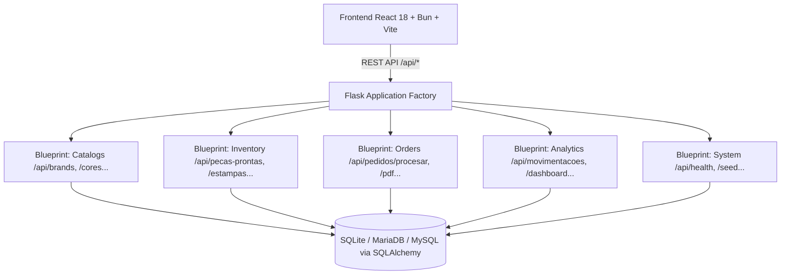

# HC_comp — Sistema de Gestión de Inventario & Producción Multi-Marca

Sistema integral para control de inventario de piezas confeccionadas (*Peças Prontas*) y estampas sueltas (*Estampas Avulsas*), procesamiento inteligente de pedidos con ingesta multi-formato (PDF Olist/Tiny, CSV, XLSX), descuento atómico en cascada, generación de reportes PDF para Imprenta y Separación, y trazabilidad completa de auditoría.

---

## 🏗️ Arquitectura del Sistema



---

## 🛠️ Stack Tecnológico

- **Backend**:
  - **Python 3.11+ / 3.14+**
  - **uv** como gestor de entorno virtual ultra-rápido y dependencias (`pyproject.toml`, `requirements.txt`)
  - **Flask 3.0+** estructurado en **Flask Blueprints** modulares
  - **SQLAlchemy 2.0+** & **PyMySQL**
  - **pdfplumber**, **pypdf** & **ReportLab** para parsing e ingesta de PDFs de Olist/Tiny y generación de documentos oficiales
  - **Pytest** (**73 tests** de integración, ingesta, cascada, PDF, concurrencia y roles RBAC)

- **Frontend**:
  - **Bun** como runtime y gestor de paquetes de alto rendimiento (`bun.lock`)
  - **React 18** + **Vite**
  - **Hooks Modulares**: `useCatalogs`, `useInventory`, `useOrders`, `useModals`, `useEstoque`
  - **Tailwind CSS** (tema oscuro/claro, microanimaciones y glassmorphism)
  - **Recharts** (gráficos analíticos en Dashboard)
  - **Sonner** & **Lucide React**
  - **Vitest** + **React Testing Library** (**19 tests**)
  - **React Doctor**: **100 / 100 Great** (0 issues)

---

## 🚀 Guía de Inicio Rápido

### 1. Backend (con `uv`)

```bash
# Entrar al directorio backend
cd backend

# Instalar dependencias
uv venv .venv
uv pip install -r requirements.txt

# Ejecutar la suite completa de pruebas (73 tests)
uv run pytest -v

# Iniciar servidor Flask (puerto 5000)
uv run python app.py
```

### 2. Frontend (con `bun`)

```bash
# Entrar al directorio frontend
cd frontend

# Instalar dependencias con Bun
bun install

# Ejecutar pruebas unitarias (19 tests)
bun run test

# Verificar auditoría de calidad React (100/100)
echo "n" | npx react-doctor@latest --verbose .

# Iniciar servidor de desarrollo (puerto 5173 con proxy a /api)
bun run dev

# Generar bundle optimizado para producción
bun run build
```

---

## 🧪 Resumen de Pruebas & Calidad

| Módulo | Comando | Estado | Métricas |
|---|---|---|---|
| **Backend** | `cd backend && uv run pytest -v` | ✅ PASS | **73 / 73 tests** (Blueprints, Cascadas, RBAC, PDFs, Locks de Concurrencia) |
| **Frontend** | `cd frontend && bun run test` | ✅ PASS | **19 / 19 tests** (Componentes, Hooks, Modales, Búsqueda SKU) |
| **React Doctor** | `cd frontend && npx react-doctor@latest --verbose .` | ✅ PASS | **100 / 100 Great** (0 advertencias de rendimiento, accesibilidad o arquitectura) |
| **Frontend Build** | `cd frontend && bun run build` | ✅ PASS | Bundle de producción generado exitosamente |

---

## 📁 Estructura del Proyecto

```text
├── backend/
│   ├── routes/              # Flask Blueprints (catalogs, inventory, orders, analytics, system)
│   ├── services/            # Lógica de negocio (parser_service, pdf_service, auth_service, catalog_service)
│   ├── tests/               # 73 tests automáticos (test_api, test_concurrency, test_pedidos_ingesta, test_models)
│   ├── models.py            # Modelos SQLAlchemy
│   ├── config.py            # Configuraciones (Development, Testing, Production)
│   ├── seed.py              # Poblado inicial de marcas, cores, tipos, tamanhos, designs y SKUs
│   └── app.py               # Application Factory
├── frontend/
│   ├── src/
│   │   ├── components/      # Componentes UI (Dashboard, Tablas, Modales, Procesador de Pedidos)
│   │   ├── hooks/           # Custom hooks modulares (useCatalogs, useInventory, useOrders, useModals, useEstoque)
│   │   ├── api.js           # Cliente API Axios
│   │   └── App.jsx          # Componente raíz
│   └── package.json
├── docs/
│   └── flujo_de_trabajo_y_roles.md  # Especificación de roles y flujos de trabajo
└── .env.example             # Plantilla de variables de entorno
```
